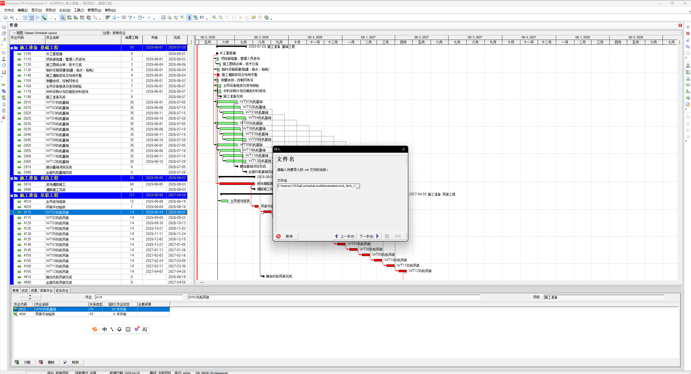

# P6 Schedule Toolkit / P6 进度计划工具包

[English](#english) | [中文](#中文)

---

## English

**P6 Schedule Toolkit** is an AI Agent-powered Primavera P6 schedule generation tool that automatically converts CSV-formatted schedules into P6-compatible XER files.

### Key Features

- **AI-Powered**: Works seamlessly with AI coding assistants like Claude Code, Cursor, and GitHub Copilot. Describe your project in natural language and let AI generate the CSV schedule automatically
- **CPM Validation**: Built-in Critical Path Method engine that detects circular dependencies, broken links, and orphaned tasks before import
- **Native P6 Compatibility**: Generated XER files can be directly imported into Primavera P6 with full support for constraints, milestones, and multiple relationship types
- **Duration-Only Scheduling**: Write durations only — let P6's scheduling engine calculate all dates and identify the critical path
- **Result Reading**: Read scheduling results directly from P6's SQLite database — no P6 client required for verification

### Use Cases

Suitable for construction scheduling in wind power, solar PV, infrastructure, and other industries.

### Screenshots

<p align="center">
  
  <br>
  <em>P6 Gantt chart after scheduling</em>
</p>

<p align="center">
  
  <br>
  <em>P6 XER import dialog</em>
</p>

### Quick Start

```bash
# Install
pip install -e .

# Convert CSV to XER
p6-to-xer schedule.csv output.xer --project "My Project" --start 2026-06-01
```

### Workflow

```
User describes project → AI Agent generates CSV → p6-to-xer converts → Import to P6 → p6-results validates
```

### Project Structure

```
p6-schedule-toolkit/
├── src/p6_schedule/        # Python package
│   ├── csv_to_xer.py       # CSV→XER converter
│   ├── read_results.py     # P6 result reader
│   ├── validate.py         # CPM network validation
│   └── cli.py              # CLI entry points
├── docs/                   # Documentation (also usable as AI knowledge base)
├── examples/               # Sample schedules
├── skills/                 # Claude Code skills
└── tests/                  # Test suite
```

### Claude Code Integration

If you use Claude Code, copy the skill files to `~/.claude/skills/`:

```bash
cp skills/p6-schedule-generator.md ~/.claude/skills/
cp skills/p6-results-reader.md ~/.claude/skills/
```

Then simply describe your project requirements (turbine count, contract milestones, resource constraints, etc.) and Claude Code will:
- Generate the CSV schedule
- Run CPM validation and XER generation
- Guide you through P6 import and result verification

---

## 中文

**P6 Schedule Toolkit** 是一款 AI Agent 驱动的 Primavera P6 施工进度计划生成工具，能够将 CSV 格式的进度计划自动转换为 P6 可导入的 XER 文件。

### 核心功能

- **AI 驱动**：配合 Claude Code / Cursor / GitHub Copilot 等 AI Agent 使用，用自然语言描述工程信息，AI 自动生成 CSV 进度计划
- **CPM 网络校验**：内置关键线路法引擎，自动检测循环依赖、断链、孤立节点
- **P6 原生兼容**：生成的 XER 文件可直接导入 Primavera P6，支持约束、里程碑、多种关系类型
- **只写工期不写日期**：由 P6 排程引擎计算所有日期和关键线路
- **结果读取**：从 P6 SQLite 数据库读取排程结果，无需 P6 客户端也可验证

### 应用场景

适用于风电、光伏、基建等施工进度计划编制。

### 效果展示

<p align="center">
  
  <br>
  <em>P6 排程后的甘特图结果</em>
</p>

<p align="center">
  
  <br>
  <em>P6 导入 XER 文件界面</em>
</p>

### 快速上手

```bash
# 安装
pip install -e .

# CSV → XER 转换
p6-to-xer schedule.csv output.xer --project "My Project" --start 2026-06-01
```

### 工作流程

```
用户描述工程信息 → AI Agent生成CSV → p6-to-xer转换 → P6导入排程 → p6-results验证
```

### 项目结构

```
p6-schedule-toolkit/
├── src/p6_schedule/        # Python包
│   ├── csv_to_xer.py       # CSV→XER转换器
│   ├── read_results.py     # P6结果读取器
│   ├── validate.py         # CPM网络校验
│   └── cli.py              # 命令行入口
├── docs/                   # 文档（也可作为AI知识库）
├── examples/               # 样例
├── skills/                 # Claude Code skills
└── tests/                  # 测试
```

### Claude Code 配合使用

如果你使用 Claude Code，将 skill 文件复制到 `~/.claude/skills/` 即可：

```bash
cp skills/p6-schedule-generator.md ~/.claude/skills/
cp skills/p6-results-reader.md ~/.claude/skills/
```

只需告诉 Claude Code 你的工程信息（风机数量、合同里程碑日期、资源约束等），它会自动：
- 编制 CSV 进度计划
- 运行 CPM 验证和 XER 生成
- 指导你导入 P6 并读取结果验证

---

## Quick Reference / 快速参考

### CSV Format / CSV 格式

```csv
wbs_path,task_code,task_name,task_type,duration_days,predecessor_code,rel_type,lag_days,constraint_type,constraint_date
施工准备,1100,开工里程碑,Milestone,0,,,,CS_MSO,2026-06-01
施工准备,1110,项目部组建,Task,3,,,,
基础工程,2010,WT01风机基础,Task,35,1100,FS,0,,
```

### Constraint Types / 约束类型

| Type | Meaning | Use Case |
|------|---------|----------|
| `CS_MSO` | Must Start On | Contract milestone nodes |

**Note**: P6 XER only recognizes `CS_MSO`. Other constraints like `CS_MFEO`/`CS_MFIN` are silently ignored.

### Import to P6 / 导入 P6

1. Open Primavera P6
2. **File → Import → XER** → Select the generated `.xer` file
3. Open project, press **F9** to schedule
4. P6 automatically calculates all dates, critical path, and float

### View Results / 查看结果

```bash
p6-results --db PPMDBSQLite.db
p6-results -p "MyProject" --milestones
p6-results -p "MyProject" --path
p6-results -p "MyProject" --gantt
```

---

## Contributing / 贡献

Contributions welcome! Issues and PRs are appreciated, especially for:
- Industry templates (solar, thermal power, transmission, etc.)
- P6 version compatibility testing
- Documentation improvements
- Bug fixes and new features

欢迎提交 Issue 和 PR！特别是：
- 新的行业模板（光伏、火电、输变电等）
- 不同 P6 版本的兼容性测试
- 文档翻译和改进
- Bug 修复和新功能
- 联系我：1253760535（微信）

## License / 许可证

MIT
